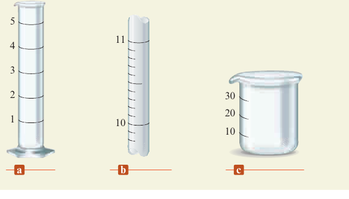
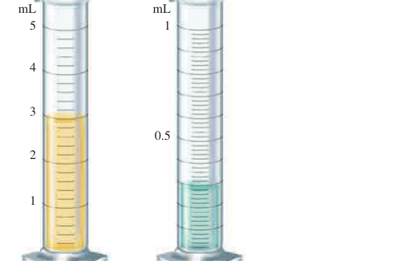

# Chemical Foundations Unit Journal

## Unit purpose

This Unit Journal records the actual learning process for measurement, laboratory foundations, density, atomic structure, and classification of substances. The chemistry subject overview is maintained separately in [Chemistry Learning Journal]({{ '/chemistry/chemical-foundations-journey/' | relative_url }}).

## Progress dashboard

| Topic | Status | Confidence | Last updated | Next step |
|---|---|---|---|---|
| Liquid Type Test safety and equipment | Applied | Medium-high | 2026-08-20 | Perform the supervised procedure. |
| Mass, volume, density, and repeated measurements | Exploring | Medium | 2026-08-20 | Calculate three real trials, mean, and range. |
| Measurement reliability and uncertainty | Exploring | Medium | 2026-08-26 | Complete the selected §1.3 and §1.4 review questions. |
| Atomic structure and classification of substances | Applied | High | 2026-08-20 | Study physical and chemical properties and changes. |

## Key knowledge and vocabulary

| Concept or term | My current explanation | Example or connection | Status |
|---|---|---|---|
| Density | Mass divided by volume. | Use repeated measurements and compare the mean with reference values. | Applied |
| Atom | The smallest unit of an element that keeps that element's identity. | The nucleus is part of an atom, not the whole atom. | Applied |
| Pure substance | Matter with fixed composition and consistent properties. | An element or compound can be a pure substance. | Applied |

## Learning entries

### Learning entry — 2026-08-20 — Liquid Type Test Experiment foundations

#### Date

2026-08-20 (Asia/Shanghai)

#### Subject and topic

Chemistry — Liquid Type Test Experiment foundations and laboratory vocabulary

#### Source or activity

Liquid Type Test Experiment document; guided explanation and vocabulary discussion.

#### What I already understood

I knew that the experiment involved measuring a liquid and using density to compare it with possible candidate substances, but I did not yet understand several laboratory terms, tools, safety instructions, or how mass and volume would be obtained.

#### What I learned

The experiment requires a safety gate, appropriate eye protection, a supervised and identified sample, a spill tray, a balance, a container with a lid, a graduated cylinder or pipette, a thermometer, labels, and a waste container. Mouth pipetting is prohibited. I learned that the balance measures mass, the volume tool measures volume, the thermometer measures temperature, the meniscus is the curved liquid surface, tare means setting the balance to zero with the empty container, and vapor is the gas form of a substance. The liquid mass is found by subtraction when the balance is not tared, and density is calculated from mass and volume.

#### My understanding now

I understand that the experiment is a controlled measurement process: use the same volume for each trial, measure the container and liquid correctly, record the temperature, repeat the measurement three times, calculate each density, and compare the mean result and spread with reference values. Safety and measurement quality come before identification.

#### Example, evidence, or application

The key calculations are:

$$m_{\text{liquid}} = m_{\text{container+liquid}} - m_{\text{empty container}}$$

$$D = \frac{m_{\text{liquid}}}{V}$$

For example, if 10.00 mL of liquid has a measured mass of 7.85 g, its density is 0.785 g/mL, subject to the precision supported by the instruments.

#### Mistake or confusion

I initially needed explanations for terms such as goggles, spill tray, vapor, mass, volume, graduated cylinder, pipette, thermometer, lid, tare, and meniscus. I also needed to clarify why mouth pipetting is unsafe and why the container must be included or tared correctly.

#### Correction

Each term describes either a safety control, a measuring tool, a measurement, or a step in the calculation. Mouth pipetting can expose a person to the sample and is never allowed; a pipette bulb or mechanical aid must be used. The container mass must be removed by taring or subtraction so that density is calculated from the liquid alone.

#### Question

How will my repeated density results, their range, and the reference temperature affect the final “consistent with” or “inconclusive” conclusion?

#### Confidence

Medium-high for the vocabulary and procedure because I can explain the main terms and sequence. I still need to perform the experiment and calculate real repeated results before claiming practical mastery.

#### Progress

Understood — I understand the purpose, safety requirements, equipment, measurements, and basic calculations, but the experiment has not yet been performed.

#### Next focus

Use the procedure to complete a real set of three measurements and calculate mass, density, mean density, and range.

### Learning entry — 2026-08-26 — Measurement reliability and uncertainty textbook questions

#### Date

2026-08-26 (Asia/Shanghai)

#### Subject and topic

Chemistry — Zumdahl Chapter 1 §1.3 Units of Measurement and §1.4 Uncertainty in Measurement

#### Source or activity

Zumdahl, *Chemistry*, 9th Edition, Chapter 1 review questions and exercises; selected questions for the current Learning Journal assignment. The selected set is four questions related to §1.3 and four related to §1.4. The textbook figures required by Questions 4 and Exercise 33 are displayed below.

#### What I knew or assumed before

I understood the basic difference between accuracy and precision, and I knew that systematic error and random error affect conclusions differently. I had not yet organized the required textbook questions or connected each question to the specific measurement concept it tests.

#### What I learned

The selected §1.3 questions focus on measurement values, units, glassware, instrument precision, uncertainty, and reading graduated cylinders. The selected §1.4 questions focus on accuracy, precision, accepted values, random error, systematic error, and interpreting repeated data. A measurement should be reported with the digits supported by the measuring device, and repeated values must be compared with an accepted value before accuracy can be judged.

#### Evidence, example, or application

**Selected questions for §1.3 — Units of Measurement**

1. **Review Question 4:** For each pictured piece of glassware, provide a sample measurement and discuss its significant figures and uncertainty.

   

2. **Review Question 13:** Sketch one piece of glassware that measures volume to the thousandths place and another that measures volume only to the ones place.

   The Journal will include my own sketches when I complete this question; the textbook does not provide a separate source figure for this prompt.

3. **Review Question 21:** Explain qualitative and quantitative observations, give the SI units for mass, length, and volume, state the assumed uncertainty unless otherwise specified, and explain how uncertainty depends on instrument precision.

4. **Exercise 33:** Read the liquid volumes in the two graduated cylinders, report them with appropriate precision, and determine how the total volume should be reported when the liquids are combined.

   

**Selected questions for §1.4 — Uncertainty in Measurement**

1. **Review Question 5:** Measurements of calcium content are \(14.92\%\), \(14.91\%\), \(14.88\%\), and \(14.91\%\), while the actual amount is \(15.70\%\). Determine what these results show about accuracy and precision.

2. **Review Question 11:** Explain why it is incorrect to say that a set of measurement results was accurate but not precise.

3. **Review Question 20:** Explain the difference between random error and systematic error.

4. **Review Question 22:** Using a true dimension of \(10.62\text{ cm}\), give examples of data that are imprecise and inaccurate, precise but inaccurate, and precise and accurate. Explain possible causes and why the wording “imprecise but accurate” needs careful interpretation.

#### My explanation now

The §1.3 questions ask how the measuring device determines the number of reported digits and the uncertainty of a measurement. The §1.4 questions ask whether repeated measurements agree with one another, whether they agree with an accepted value, and whether the error is random or systematic. Precision describes agreement among repeated measurements; accuracy describes agreement with the accepted or true value.

#### Question or uncertainty

I still need to complete the eight selected questions and draw the two pieces of glassware required by Review Question 13. I also need to check whether the course expects the §1.3 and §1.4 selections to be labeled as Review Questions or Exercises in the submitted Journal.

#### Mistake or confusion

I initially treated selecting the questions as if the assignment were complete. The questions are selected, but their solutions and reasoning still need to be worked out and recorded. I also need to distinguish the source figures from my own required drawings.

#### Correction

The Journal now records the selected questions separately from completed solutions. The two textbook figures are embedded for the questions that contain them, while Review Question 13 is marked for an original student drawing.

#### Confidence

Medium. I can explain the main measurement concepts and why each question belongs to §1.3 or §1.4, but I have not yet completed all eight solutions.

#### Progress

Exploring — the question set and evidence requirements are organized, but the calculations, drawings, and final written answers remain to be completed.

#### Next focus

Complete §1.3 Review Question 4 first by reading each glassware scale, then complete Review Question 13 and Exercise 33 before moving to the four §1.4 data-analysis questions.

### Learning entry — 2026-08-20 — Atomic structure and classification of substances

#### Date

2026-08-20 (Asia/Shanghai)

#### Subject and topic

Chemistry — Atomic structure, molecules, elements, compounds, and pure substances

#### Source or activity

Zumdahl, *Chemistry*, 9th Edition, Chapter 1 “Chemical Foundations”; guided learning discussion.

#### What I already understood

From the experiment discussion, I understood that matter has mass and occupies space, and that mass, volume, temperature, and density are important measurements.

#### What I learned

An atom is the smallest unit of an element that keeps that element’s identity. An atom contains a nucleus and electrons. The nucleus contains positively charged protons and neutral neutrons; negatively charged electrons are found around the nucleus. A molecule is made of two or more chemically joined atoms. An element contains one type of atom, while a compound contains different elements chemically joined in a fixed ratio. A pure substance has a fixed composition and consistent properties.

#### My understanding now

I understand the relationship between these ideas: atoms can join to form molecules; one type of atom forms an element; different elements chemically joined form a compound; and an element or compound can be a pure substance. The number of protons identifies the element, while the charges are positive for protons, neutral for neutrons, and negative for electrons.

#### Example, evidence, or application

O₂ is an element because it contains only oxygen atoms. H₂O is a compound because it contains hydrogen and oxygen in a fixed ratio. The density experiment measures a macroscopic property of a sample, while atoms and molecules provide a microscopic explanation of what the sample is made of.

#### Mistake or confusion

I first confused the nucleus with the atom and thought the nucleus was the smallest unit that keeps an element’s identity. I also temporarily reversed the charges of the neutron and electron. I confused “质子” (proton) with “正子” (positron).

#### Correction

The atom—not the nucleus—is the smallest unit of an element that keeps its identity. The nucleus is the central part of the atom. A proton is positive, a neutron has no charge, and an electron is negative. “质子” means proton; “正子” usually means positron, which is not a normal component of an atom.

#### Question

What is the difference between a physical property and a chemical property, and how is a physical change different from a chemical change?

#### Confidence

High for the basic structure and definitions because I can explain the relationships and correct my earlier mistakes. I still need practice applying these ideas to physical and chemical changes.

#### Progress

Understood — I can explain the basic atomic structure and distinguish atoms, molecules, elements, compounds, and pure substances.

#### Next focus

Physical properties, chemical properties, physical changes, and chemical changes.

## Concepts to revisit

- Scientific method
- Physical properties and chemical properties
- Physical changes and chemical changes
- Mixtures and methods of separation
- Measurement uncertainty, accuracy, and precision
- Significant figures and dimensional analysis
- Density evidence and the limits of identification

## Mistakes and corrections

| Date | Topic | Mistake | Correction |
|---|---|---|---|
| 2026-08-20 | Experiment measurements | I was unsure how to obtain the liquid mass when the container was also on the balance. | Tare the empty container or subtract the empty-container mass from the container-plus-liquid mass. |
| 2026-08-20 | Laboratory safety | I needed clarification about mouth pipetting and vapor. | Mouth pipetting is prohibited because it can expose the mouth or lungs to the sample; vapor is the gas form of a substance and may require stopping the experiment. |
| 2026-08-20 | Atom and nucleus | I said the nucleus was the smallest unit that keeps an element’s identity. | The atom is the smallest unit; the nucleus is only the atom’s central part. |
| 2026-08-20 | Charges of particles | I confused the charges of the neutron and electron. | The proton is positive, the neutron is neutral, and the electron is negative. |
| 2026-08-20 | Chinese terminology | I used “正子” for proton. | Proton is “质子”; “正子” usually means positron. |

## Questions I am carrying forward

- How can I identify whether an observed change is physical or chemical?
- How do repeated density results and their range affect the experiment’s conclusion?

## Review record

| Date | Subject | Topic | Current progress | Next step |
|---|---|---|---|---|
| 2026-08-20 | Chemistry | Liquid Type Test Experiment foundations | Understood the main vocabulary, safety requirements, equipment, measurement sequence, and basic density calculations; experiment not yet performed. | Complete three real trials and calculate the results. |
| 2026-08-20 | Chemistry | Atomic structure and classification of substances | Understood atoms, subatomic particles, molecules, elements, compounds, and pure substances; corrected key misunderstandings. | Learn physical and chemical properties and changes. |
| 2026-08-26 | Chemistry | Measurement reliability and uncertainty | Selected four §1.3 and four §1.4 textbook questions; embedded the two source figures; solutions and student sketches remain to be completed. | Complete the eight questions with calculations, reasoning, and final conclusions. |
