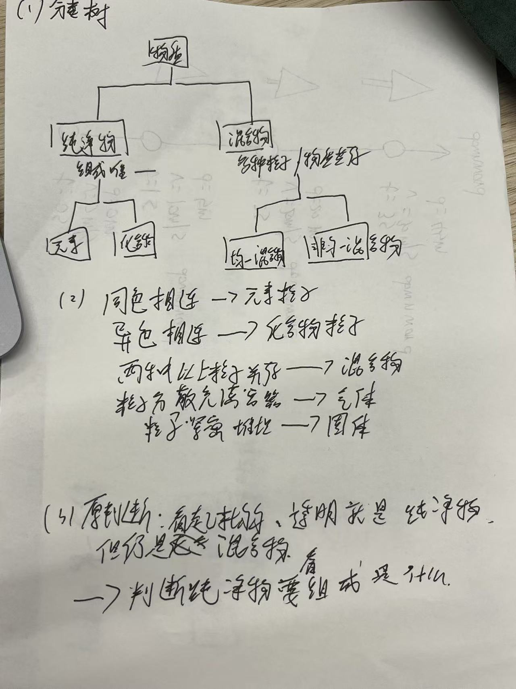

# Lesson 6 Classification of Matter and Change Learning Journal

## Purpose

This independent Journal records the actual learning process for Lesson 6: using fixed composition and uniformity to classify matter, using particle models to explain the classification, distinguishing physical and chemical changes, and evaluating observations, inferences, and evidence limits.

The primary reference is Zumdahl, *Chemistry*, 9th Edition, Chapter 1, §1.10 “Classification of Matter,” printed pp. 27–31, with the related changes and separation discussion on pp. 29–30. The Khan Academy video on types of mixtures is an auxiliary resource only.

## Progress dashboard

| Topic | Next step |
| --- | --- |
| Pure substances and mixtures | Explain the classification rule using composition and uniformity. |
| Elements and compounds | Use particle models to distinguish one element, one compound, and a mixture. |
| Homogeneous and heterogeneous mixtures | Test whether uniform appearance is sufficient evidence of purity. |
| Physical and chemical changes | Compare water boiling with water electrolysis by tracking chemical identity explicitly. |
| Evidence, inference, and limits | Use a judgment–evidence–limitation statement about pure water and salt water. |
| Selected textbook or Study Guide exercises | Select and solve four classification/change questions with reasons and revisions. |
| One-page classification evidence | Add the classification tree, the particle-diagram reasoning from textbook Exercise 1.79 (p. 38), and one original-judgment → evidence → revision sentence. |
| Check Out Questions | Answer all three questions using classification, composition, and chemical-identity evidence. |

## Key knowledge and vocabulary

| Concept or term | My current explanation | Example or connection |
| --- | --- | --- |
| Pure substance | Not yet recorded from my own explanation. | Fixed composition and characteristic properties. |
| Mixture | Not yet recorded from my own explanation. | Components are physically combined rather than chemically joined in one fixed ratio. |
| Element | Not yet recorded from my own explanation. | A pure substance containing one type of atom. |
| Compound | Different elements are chemically bonded and arranged in a fixed ratio. | A pure substance containing different elements chemically joined in a fixed ratio. |
| Homogeneous mixture | Not yet recorded from my own explanation. | Uniform throughout at the scale being considered. |
| Heterogeneous mixture | Not yet recorded from my own explanation. | Nonuniform composition at the scale being considered. |
| Physical change | Chemical identity stays the same, even if the state changes. | Boiling: H₂O(l) becomes H₂O(g). |
| Chemical change | Chemical identity changes and new substance(s) form. | Electrolysis: H₂O becomes H₂ and O₂. |
| Observation | Not yet recorded from my own explanation. | What is directly seen or measured. |
| Inference | Not yet recorded from my own explanation. | An interpretation drawn from observations and prior knowledge. |
| Evidence limit | A measurement can support a judgment but cannot prove the sample's identity by itself. | Matching pure-water density does not alone prove a sample is pure water. |

## Learning records

### Learning record — 2026-09-01 — Transparent liquids and evidence of purity

#### question

1.canot 2.the apperance suggests that its a liquid 3.density,ph value,加热后是否结晶

#### respond

The learner correctly judged that appearance alone cannot identify which transparent liquid is a pure substance. The appearance establishes that both samples are liquids and appear uniform at the current observation scale, but it does not establish fixed composition or purity. Density is a useful possible comparison when temperature, reference values, concentration, and measurement quality are controlled, but it is not an absolute identity test. pH measures acidity/basicity rather than the full composition and is not a general discriminator between pure water and every salt solution. Controlled evaporation followed by observing nonvolatile crystals can support the presence of dissolved salt, while a lack of crystals does not prove purity because evaporation may be incomplete, the concentration may be low, or the solute may be volatile.

#### reflection

The response shows the correct first judgment but only a partial evidence model. The learner identified “liquid” as the appearance evidence; this needs refinement to “transparent and apparently homogeneous,” followed by the limit that uniform appearance is not proof of fixed composition. The learner proposed three tests; density and crystallization can be useful with explicit controls, while pH has a weaker connection to the classification question. Current runtime evidence classified this as reconsideration rather than mastery (recall score 0.25, independent response). Next intervention: teach-back of what appearance can and cannot establish, followed by a controlled-evidence choice.

### Learning record — 2026-09-01 — Definitions: element, substance, pure substance, and mixture

#### question

元素，物质的定义是什么，纯净物，混合物

#### respond

An element is a pure substance that contains only one type of atom and cannot be decomposed into simpler substances by chemical means. O₂ is still an element because every molecule contains only oxygen atoms. A substance is a kind of matter with its own chemical identity, composition, and characteristic properties; oxygen, water, and sodium chloride are examples. A pure substance contains only one substance and has a fixed composition, so it is either an element or a compound. A mixture contains two or more substances physically combined; its composition can vary, its components keep their own chemical identities, and they can often be separated by physical methods. Salt water is therefore a homogeneous mixture, not a pure substance.

#### reflection

The learner is asking for the four terms that organize this lesson's classification tree. The key relationship is element ⊂ pure substance, compound ⊂ pure substance, while a mixture contains multiple substances and may be homogeneous or heterogeneous. The remaining point to retrieve independently is that “substance” here refers to a distinct chemical kind, whereas “mixture” is a sample containing more than one substance. Next intervention: classify O₂, H₂O, and salt water and give one reason for each.

### Learning record — 2026-09-01 — Meaning of homogeneous

#### question

什么是homogeneous

#### respond

Homogeneous means uniform throughout: at the scale being considered, different parts of a sample have the same composition and properties. A homogeneous mixture has its components distributed evenly and appears as one phase, such as salt water after the salt dissolves. Homogeneous does not mean pure: salt water is homogeneous but remains a mixture because its composition contains water and dissolved salt and can vary. In a particle model, the different particle types in a homogeneous mixture are evenly interspersed. The opposite term is heterogeneous, meaning nonuniform.

#### reflection

The learner asked for the meaning of a key classification term immediately after using “liquid” as appearance evidence. The next check should distinguish “uniform appearance” from “fixed composition” and connect the distinction to a particle diagram. No independent teach-back of the definition has been collected yet.

### Learning record — 2026-09-01 — Homogeneous mixture versus pure substance

#### question

盐水是homogenous，但是不是puresubstance

#### respond

The learner correctly identified that salt water can be homogeneous but is not a pure substance. Homogeneous describes whether the sample is uniform from part to part; pure substance describes whether the composition is fixed and consists of one substance. Salt water can be a homogeneous mixture when the salt is evenly dissolved, but its salt concentration can vary. Pure water is generally both homogeneous and a pure substance because each part contains H₂O with fixed composition.

#### reflection

The learner has the correct classification for salt water but gave only one side of the comparison and did not yet state the defining reason. The key distinction is now being rebuilt as “uniform distribution” versus “fixed composition.” Runtime teach-back evidence still classified the response as reconsideration (explanation score 0.25), so this concept is not yet demonstrated as mastered. Next intervention: complete a two-part sentence for salt water and pure water, then apply the distinction to a particle model.

### Learning record — 2026-09-01 — Correcting the reason for salt water's classification

#### question

盐水是homogenous，因为盐的比例可以改变，纯水是puresubstance，因为各部分都是H2O，组成固定

#### respond

The classification of salt water as homogeneous was correct, and the classification of pure water as a pure substance was also correct. The reasons needed to be separated: salt water is homogeneous because the dissolved salt is evenly distributed, while the fact that the salt-to-water ratio can vary explains why salt water is not a pure substance. Pure water is a pure substance because every part contains H₂O and its composition is fixed. A uniformly distributed particle diagram can show homogeneity, but it cannot by itself prove purity.

#### reflection

The learner now has the main categories, but initially attached the variable-ratio reason to homogeneous instead of to “not pure substance.” This is a near-miss between two different classification criteria, not a failure of the overall classification. Runtime evidence remains at reconsideration (explanation score 0.25), so the next checkpoint is a particle-model application that asks for both uniformity and fixed-composition judgments.

### Learning record — 2026-09-01 — Check Out 1: choosing density as evidence

#### question

我选择density作为区分证据，因为盐水和纯水的密度不同

#### respond

The learner selected density as a possible distinguishing test because salt water and pure water usually have different densities. This is a reasonable evidence choice under controlled conditions. The missing part is the evidence boundary: density depends on temperature, salt concentration, reference values, and measurement quality, so a density result supports consistency with a candidate but does not by itself prove purity or identity.

#### reflection

The learner can propose a relevant physical-property test and give its basic rationale, but has not yet stated the limitation required by the Check Out question. The next intervention is a short completion of the boundary sentence, followed by checking whether the learner can distinguish “supports a claim” from “proves a claim.” Runtime evidence classified this response as reconsideration (explanation score 0.25, independent response).

### Learning record — 2026-09-01 — Check Out 1: density evidence boundary

#### question

边界是受温度，盐浓度和测量误差影响

#### respond

The learner correctly identified temperature, salt concentration, and measurement error as limitations on density evidence. A complete evidence statement adds that even a matching density supports consistency with a candidate substance under controlled conditions; it does not by itself prove identity or purity. Check Out 1 is now conceptually complete, and the next question is the classification of O₂, H₂O, and a sample containing both.

#### reflection

The learner successfully supplied the missing boundary factors after a hint. This shows the relevant evidence limitation can be recalled, although the stronger distinction between “supports” and “proves” still needs to be stated explicitly in a complete sentence. Runtime recorded the response independently but its local keyword evaluator did not recognize the Chinese answer (score 0); this runtime score is not treated as proof that the chemistry reasoning was absent. Next intervention: classify three particle compositions using element, compound, and mixture criteria.

### Learning record — 2026-09-01 — Check Out 2: classifying O₂, H₂O, and a mixture

#### question

A是element，因为它只有一种分子构成 B是compound，因为它由两种及以上的元素构成 C是mixture，因为它由两种化合物组成

#### respond

The classifications were mostly correct: A is an element, B is a compound, and C is a mixture. The reasons require precision. O₂ is an element because it contains only oxygen atoms, even though those atoms are paired into O₂ molecules. H₂O is a compound because hydrogen and oxygen atoms are chemically bonded in a fixed ratio; having two or more elements alone is not sufficient, because a mixture can also contain multiple elements. C is a mixture because it contains two different substances, O₂ and H₂O; O₂ is an element and H₂O is a compound, not two compounds.

#### reflection

The learner can select the correct category for all three cases but is still mixing particle count, atom type, element count, and number of substances. The central correction is to classify the composition at the correct level: one atom type, chemically bonded different atom types in a fixed ratio, or multiple substances present together. Runtime evidence recorded this as reconsideration (explanation score 0.25), so the reasons need an independent revision before Check Out 2 is complete. Next intervention: rewrite all three explanations using “only one type of atom,” “different elements chemically bonded in a fixed ratio,” and “two different substances.”

### Learning record — 2026-09-01 — Check Out 2 revision: composition criteria

#### question

A是element，因为只包含一种原子 B是compound，因为包含不同元素 C是mixture，因为同时含有两种不同物质

#### respond

The revision corrected A to “only one type of atom” and C to “two different substances.” B remains incomplete: different elements must be chemically bonded and present in a fixed ratio for the substance to be a compound. The complete classification is A: element, B: compound, C: mixture.

#### reflection

The learner now distinguishes one atom type and multiple substances, but still omits the defining relationship for a compound. “Contains different elements” is not sufficient because a mixture can also contain different elements without chemical bonding or a fixed ratio. Check Out 2 remains in revision rather than complete until the learner states both “chemically bonded” and “fixed ratio” for H₂O.

### Learning record — 2026-09-01 — Check Out 2 correction: compound versus mixture

#### question

A是element，因为只包含一种原子 B是compound，因为氢元素和氧元素化学结合，组成氧这种物质 C是mixture，因为它是由两种不同的物质结合在一起，并固定比例组成h2O

#### respond

A is correctly classified as an element because it contains only one type of atom. The B and C explanations are still reversed in part. Hydrogen and oxygen chemically combine in a fixed ratio to form H₂O, which is water and therefore a compound—not oxygen. C is a mixture because O₂ and H₂O are two different substances present together; they are not chemically combined into one new substance with a fixed ratio.

#### reflection

The learner has retained the correct category for A but is still confusing the names of substances and the criteria for compounds versus mixtures. The phrase “组成氧这种物质” must be replaced with “组成水（H₂O）这种物质,” and C must not be described as fixed-ratio chemical combination. Check Out 2 remains incomplete until B and C are independently rewritten with the correct relationships.

### Learning record — 2026-09-01 — Check Out 2 completed revision

#### question

B是compound因为它是由两种不同的元素化学结合在一起以固定比例形成h2O这种物质 C是mixture因为它是由两种不同物质同时存在

#### respond

The learner independently stated the correct compound criterion for B: different elements chemically combine in a fixed ratio to form H₂O. The learner also correctly stated the mixture criterion for C: two different substances are present at the same time. Check Out 2 is complete at the classification-and-reason level.

#### reflection

The learner corrected both earlier near-misses: H₂O is water rather than oxygen, and O₂ plus H₂O are coexisting substances rather than one fixed-ratio compound. This provides a clear explanation for element, compound, and mixture in the assigned cases. The next task is to distinguish physical and chemical changes by tracking chemical identity.

### Learning record — 2026-09-01 — Check Out 3: physical and chemical changes

#### question

水沸腾是物理变化，因为没有化学物质发生改变 水电解是化学变化，因为有化学物质发生改变

#### respond

The learner correctly classified boiling as a physical change and electrolysis as a chemical change. The explanation needs the explicit chemical identities: H₂O(l) becomes H₂O(g) during boiling, so the identity remains H₂O; during electrolysis, H₂O forms H₂ and O₂, so new substances appear and the chemical identity changes. “Chemical substance changes” is directionally correct but less precise than tracking the formulas.

#### reflection

The learner distinguishes physical and chemical change by the presence or absence of new substances, but has not yet independently written the chemical identities required by the assignment. The next intervention is to rewrite both cases with H₂O(l) → H₂O(g) and H₂O → H₂ + O₂.

### Learning record — 2026-09-01 — Review classification: O₂, H₂O, and salt water

#### question

O2属于元素，因为它是相同原子组成的 h2O属于物质，它是由两种不同的元素组合在一起 盐水属于mixture，它是由两种不同的物质同时存在

#### respond

O₂ is correctly classified as an element because it contains only oxygen atoms. H₂O is more specifically a compound and therefore also a pure substance: hydrogen and oxygen are chemically bonded in a fixed ratio. “Substance” is a general term, not the most specific classification here. Salt water is correctly classified as a mixture because water and dissolved salt are two substances physically present together; their proportion can vary and they retain their chemical identities.

#### reflection

The learner can identify the element and mixture cases, but used the broad word “substance” instead of the specific category “compound” for H₂O. The next intervention is to retrieve the classification tree: O₂ → element → pure substance; H₂O → compound → pure substance; salt water → mixture. The mixture reason should also include physical combination and variable composition.

### Learning record — 2026-09-01 — Refining the compound definition for H₂O

#### question

h2O属于compound，因为由两种不同的元素组成

#### respond

The learner correctly classified H₂O as a compound. The reason is incomplete: a compound is not defined only by containing different elements, because a mixture can also contain different elements. In H₂O, hydrogen and oxygen are chemically bonded in a fixed ratio, 2:1, to form one chemical substance.

#### reflection

The learner has corrected the category from the broader word “substance” to “compound,” but still needs the complete distinguishing rule. Next intervention: add both missing criteria—chemical bonding and fixed ratio—and explain why “different elements” alone cannot separate a compound from a mixture.

### Learning record — 2026-09-01 — Complete compound definition for H₂O

#### question

h2O是compound，因为它是由两种不同的元素以化学键结合，并按照固定比例组成

#### respond

The learner independently gave the complete definition for H₂O as a compound: it contains different elements that are chemically bonded and arranged in a fixed ratio. This correctly distinguishes H₂O from a mixture that merely contains different substances together.

#### reflection

The learner repaired the earlier incomplete reason and now connects the category “compound” to both chemical bonding and fixed composition. This is a successful explanation for H₂O. The next transfer is to use the same criteria with a particle diagram and to contrast H₂O with salt water.

### Learning record — 2026-09-01 — Completed chemical-identity explanation for boiling and electrolysis

#### question

水沸腾是物理变化，因为没有化学物质发生改变，前后都是h2o，水电解是化学变化，因为有化学物质发生改变，变化之前是h2o，变化后是h2和o2

#### respond

The learner correctly explained both changes using chemical identity. During boiling, H₂O changes from liquid to gas but remains H₂O, so the change is physical. During electrolysis, H₂O changes into H₂ and O₂, which are new substances, so the change is chemical.

#### reflection

The learner independently supplied the missing before-and-after identities and satisfied the Check Out 3 requirement. Physical and chemical changes are now applied successfully in these cases. The next remaining Lesson 6 task is to complete four textbook or Study Guide exercises and then write the judgment–evidence–limitation statement.

### Learning record — 2026-09-01 — Meaning of judgment, evidence, and limitation

#### question

“判断—证据—限制”段落是什么

#### respond

This is a scientific reasoning structure: state a judgment, give the observation or measurement that supports it, and then state what that evidence cannot establish by itself. For this lesson, an example is: “I judge that the sample may be salt water because its density differs from pure water when measured at the same temperature; however, density is affected by temperature, salt concentration, and measurement error, so it supports the judgment but does not prove the sample's identity by itself.”

#### reflection

The learner asked for the meaning of the final Lesson 6 writing task. The important distinction is that evidence supports a conclusion without automatically proving it; the limitation names alternative explanations or conditions that weaken the claim. The learner has not yet written an independent version. Next intervention: write one judgment–evidence–limitation paragraph about pure water versus salt water.

### Learning record — 2026-09-01 — First judgment–evidence–limitation paragraph

#### question

我判断样品可能是纯水，因为在相同温度下它的密度与纯水相同，但密度会受温度，盐浓度和测量误差影响，所以只能支持判断，不能单独证明样品一定是盐水

#### respond

The learner included all three parts: a judgment, density as evidence, and limitations involving temperature, salt concentration, and measurement error. The final clause does not match the judgment: the paragraph judges that the sample may be pure water, so the limitation should say that matching pure-water density cannot by itself prove the sample is pure water. Other liquids or solutions could have a similar density.

#### reflection

The learner understands the structure and selected a relevant controlled measurement, but needs to keep the claim and limitation about the same target. This is a reasoning-precision issue rather than a missing paragraph structure. Next intervention: replace “不能单独证明样品一定是盐水” with a limitation about not proving that the sample is pure water.

### Learning record — 2026-09-01 — Completed judgment–evidence–limitation paragraph

#### question

我判断样品可能是纯水，因为在相同温度下它的密度与纯水相同，但密度会受温度，盐浓度和测量误差影响，所以只能支持判断，不能单独证明样品一定是纯水

#### respond

The learner corrected the target of the limitation so it matches the judgment. The paragraph now contains a cautious judgment that the sample may be pure water, density measured at the same temperature as supporting evidence, and relevant limitations: temperature, salt concentration, and measurement error. It correctly states that the evidence supports the judgment but does not prove the sample is pure water by itself.

#### reflection

The learner independently completed the judgment–evidence–limitation structure and repaired the earlier mismatch between the judgment and the limitation. Evidence, inference, and limits are now applied for this case. The remaining Lesson 6 requirement is to complete four textbook or Study Guide exercises.

### Learning record — 2026-09-01 — Why appearance cannot prove purity

#### question

为什么不能只凭外观判断纯度

#### respond

Appearance can show macroscopic features such as transparency, uniformity, and liquid state, but it cannot directly reveal the particle types or their ratios. Pure water and homogeneous salt water can look the same while having different compositions. Therefore, appearance is an observation, whereas purity is a conclusion that needs additional evidence about composition or characteristic properties.

#### reflection

The learner is focusing on the boundary between observation and inference. The key correction is that “transparent” and “uniform-looking” describe what is observed, but fixed composition and one chemical kind are not established by appearance alone. The learner can now connect this distinction to the earlier density evidence; the remaining practice is to state the evidence limit in a complete paragraph.

### Learning record — 2026-09-01 — Meaning of compound

#### question

什么是化合物

#### respond

A compound is a pure substance made of two or more different elements that are chemically bonded in a fixed ratio. Because the elements are chemically combined, the compound has its own chemical identity and properties. Water, H₂O, is a compound: hydrogen and oxygen are bonded in a fixed 2:1 atom ratio. Salt water is not a compound because water and dissolved salt are separate substances physically mixed together.

#### reflection

The learner is revisiting the defining category after successfully repairing an earlier incomplete explanation. The essential criteria are different elements, chemical bonding, and fixed ratio; “different elements” alone is not enough because a mixture can also contain different elements. Next intervention: apply the definition to a new formula or particle diagram.

### Learning record — 2026-09-01 — Meaning of pure substance

#### question

什么是纯净物

#### respond

A pure substance is matter that contains only one chemical substance and therefore has a fixed composition and characteristic properties. It can be an element, such as O₂, or a compound, such as H₂O. Pure water contains only H₂O particles. Salt water may be uniform throughout, but it contains water and dissolved salt, so it is a homogeneous mixture rather than a pure substance.

#### reflection

The learner is clarifying the classification level above element and compound. The crucial distinction is between fixed composition and uniform appearance: a pure substance is one chemical kind with fixed composition, while a homogeneous mixture can look uniform but contain multiple substances. Next intervention: explain why salt water is homogeneous but not a pure substance.

## Concepts to revisit

- The difference between uniform appearance and fixed composition.
- How particle diagrams show elements, compounds, and mixtures.
- How chemical identity changes—or does not change—during boiling and electrolysis.
- The boundary between an observation, an inference, and sufficient evidence.

## Mistakes and corrections

| Date | Topic | Mistake | Correction |
| --- | --- | --- | --- |
| 2026-09-01 | Appearance and purity | I treated “it is a liquid” as the main evidence for distinguishing pure water from salt water. | Appearance can show a liquid that looks transparent and homogeneous, but fixed composition and purity require stronger evidence. |
| 2026-09-01 | Compound criterion | I first used “different elements” alone as the reason H₂O is a compound. | A compound has different elements chemically bonded in a fixed ratio; different elements alone may also occur in a mixture. |
| 2026-09-01 | Evidence limitation | I judged that a sample might be pure water but wrote a limitation about proving it was not salt water. | The limitation must match the judgment: equal density supports possible pure water but does not prove the sample is pure water. |

## One-page classification evidence

This page records my classification tree, particle-based clues, and the judgment–evidence–revision reasoning used for this lesson.

## Check Out Questions

checkoutquestions:
1. 纯水与盐水都均匀透明。为什么不能只凭外观判断纯度？提出一项可区分它们的证据，并说明该证据的边界。
answer: 我选择density作为区分证据，因为盐水和纯水的密度不同
answer: 边界是受温度，盐浓度和测量误差影响
answer: 我判断样品可能是纯水，因为在相同温度下它的密度与纯水相同，但密度会受温度，盐浓度和测量误差影响，所以只能支持判断，不能单独证明样品一定是盐水
answer: 我判断样品可能是纯水，因为在相同温度下它的密度与纯水相同，但密度会受温度，盐浓度和测量误差影响，所以只能支持判断，不能单独证明样品一定是纯水

2. A只有O₂；B只有H₂O；C同时有O₂和H₂O。分别属于元素、化合物还是混合物？解释你的分类依据。
answer: A是element，因为它只有一种分子构成 B是compound，因为它由两种及以上的元素构成 C是mixture，因为它由两种化合物组成
answer: A是element，因为只包含一种原子 B是compound，因为包含不同元素 C是mixture，因为同时含有两种不同物质
answer: A是element，因为只包含一种原子 B是compound，因为氢元素和氧元素化学结合，组成氧这种物质 C是mixture，因为它是由两种不同的物质结合在一起，并固定比例组成h2O
answer: B是compound因为它是由两种不同的元素化学结合在一起以固定比例形成h2O这种物质 C是mixture因为它是由两种不同物质同时存在
answer: h2O属于compound，因为由两种不同的元素组成

3. 水沸腾与水电解都可能出现气泡。分别属于什么变化？用变化前后的化学身份解释，不能只说“有气泡”。
answer: 水沸腾是物理变化，因为没有化学物质发生改变 水电解是化学变化，因为有化学物质发生改变
answer: 水沸腾是物理变化，因为没有化学物质发生改变，前后都是h2o，水电解是化学变化，因为有化学物质发生改变，变化之前是h2o，变化后是h2和o2
