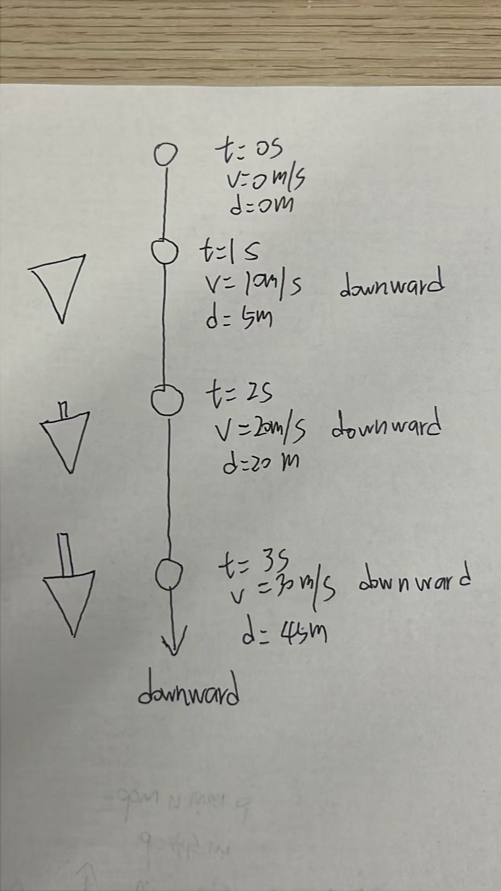

# Physics Chapter 3 Learning Journal

## Unit purpose

This Unit Journal records my learning about linear motion: reference frames, speed, velocity, and acceleration. It keeps the detailed explanations, examples, mistakes, and corrections for Chapter 3 separate from the Physics subject overview.

## Progress dashboard

| Topic | Status | Confidence | Last updated | Next step |
|---|---|---|---|---|
| Relative motion | Applied | High | 2026-08-25 | Complete the selected textbook questions. |
| Speed and velocity | Applied | Medium-high | 2026-08-25 | Complete the selected textbook questions. |
| Acceleration and free fall | Applied | Medium-high | 2026-08-26 | Review terminal velocity and the limits of the free-fall model. |

## Key knowledge and vocabulary

| Concept or term | My current explanation | Example or connection | Status |
|---|---|---|---|
| Relative motion | Motion is described relative to a reference point. | I am stationary relative to a train seat but moving relative to the ground. | Applied |
| Speed | A scalar quantity describing how fast an object moves. | \(5\ \text{m/s}\) gives a magnitude but no direction. | Applied |
| Velocity | A vector quantity describing speed and direction. | \(5\ \text{m/s}\) east includes both magnitude and direction. | Applied |
| Acceleration | The rate at which velocity changes with time. | Turning at constant speed still produces acceleration because direction changes. | Partly understood |

## Learning entries

- <a href="#questions-selected">Questions Selected</a>

### Learning entry — 2026-08-25 — Relative motion, speed, velocity, and acceleration

#### Date

2026-08-25

#### Subject and topic

Physics — Chapter 3: Linear Motion; sections 3.1 Motion Is Relative, 3.2 Speed, 3.3 Velocity, and 3.4 Acceleration.

#### Source or activity

Paul G. Hewitt, *Conceptual Physics*, Twelfth Edition, pages 39–46; Khan Academy High School Physics, Unit 1, Lesson 1: Describing Motion; Check Out Questions and follow-up practice.

#### What I knew or assumed before

I understood that speed described how fast something moved and that velocity included direction. I was less certain about how the reference object affects motion and why a change in direction counts as acceleration.

#### What I learned

1. **Motion is relative.** If I sit in a moving high-speed train, I am stationary relative to the carriage but moving relative to the ground.

2. **Speed and velocity are different.** Speed describes only how fast an object moves and is a scalar. Velocity describes how fast an object moves and its direction, so it is a vector. An object running one lap at constant speed on a circular track has changing velocity because its direction changes continuously.

3. **Acceleration describes the change in velocity over time.** An object can have acceleration even when its speed stays constant, because a change in direction changes its velocity. A bicycle turning around a corner is an example.

#### Evidence, example, or application

The train example changes depending on the reference frame. The circular-track example shows that constant speed does not mean constant velocity. A bicycle turning at nearly constant speed shows that changing direction produces acceleration.

#### My explanation now

Motion must be described relative to a reference point. Speed is the magnitude of motion without direction, while velocity includes both magnitude and direction. Acceleration is the rate of change of velocity, so speeding up, slowing down, and turning can all be acceleration.

#### Question or uncertainty

How can I represent and calculate acceleration when velocity changes in two directions at once? How do position-time and velocity-time graphs show these changes?

#### Mistake or confusion

I initially treated constant speed as meaning no acceleration and was unsure why a value written in \(\text{m/s}\) could be connected with velocity when the direction was not written in the unit.

#### Correction

The unit \(\text{m/s}\) does not contain direction; it can be used for both speed and velocity. Velocity includes direction as additional information. Since acceleration depends on the change in velocity, a direction change produces acceleration even when speed is constant.

#### Confidence

Medium-high — I can explain the three ideas and apply them to familiar examples, but vector components and graph interpretation still need practice.

#### Progress

Applied — I can use the concepts in familiar situations and explain the main distinction between speed, velocity, and acceleration.

#### Next focus

Practise acceleration vectors, position-time graphs, and velocity-time graphs.

### Learning entry — 2026-08-26 — How velocity changes in vertical motion

#### Date

2026-08-26

#### Subject and topic

Physics — Lesson 3: How Velocity Changes; Chapter 3.5 Free Fall and vertical motion.

#### Source or activity

Paul G. Hewitt, *Conceptual Physics*, Twelfth Edition, Chapter 3.5, printed pp. 46–50; Khan Academy, “Falling objects”; core question about a ball thrown vertically upward.

#### What I knew or assumed before

I understood that a ball stops moving upward at its highest point, so I answered \(v=0\). I also answered \(a=0\), because I thought the velocity and acceleration factors were different.

#### What I learned

At the highest point, the ball’s instantaneous velocity is \(v=0\), but gravity is still acting. If upward is positive, the acceleration remains \(a\approx-10\ \mathrm{m/s^2}\). The ball’s velocity is changing from upward to downward, so its acceleration is not zero.

#### Evidence, example, or application

For a ball thrown upward at \(20\ \mathrm{m/s}\), its velocity decreases by about \(10\ \mathrm{m/s}\) each second: \(+20\), \(+10\), \(0\), then \(-10\ \mathrm{m/s}\). The velocity is zero for only an instant at the top, while the acceleration remains downward throughout the motion.

#### My explanation now

Velocity tells the ball’s motion at one instant. Acceleration tells how its velocity is changing. Therefore, \(v=0\) at the top does not mean \(a=0\); the ball is about to change from moving upward to moving downward because gravity continues to give it downward acceleration.

#### Question or uncertainty

Can I use a positive-up coordinate system to find the velocity and displacement at any time during a vertical throw?

#### Mistake or confusion

I treated zero velocity at the highest point as zero acceleration and explained the difference only by saying that their “factors” were different.

#### Correction

The important difference is not just their units. Acceleration is the rate of change of velocity. At the highest point, the velocity is momentarily zero, but it is changing, so \(a=-g\), not zero.

#### Confidence

Medium — I correctly identified \(v=0\), and I now know why the acceleration remains downward, but I need more practice using signs and equations.

#### Progress

Partly understood — I can explain the central correction, but I still need to apply it to timed vertical-motion problems.

#### Next focus

Complete the three Check Out Questions and draw the first three seconds of a dropped object’s motion with its velocities and cumulative distances.

### Learning entry — 2026-08-26 — Check Out Question 1: Free fall

#### Date

2026-08-26

#### Subject and topic

Physics — Chapter 3.5 Free Fall: definition of free fall and the role of air resistance.

#### Source or activity

Conceptual Physics, Chapter 3.5, pp. 46–50; Check Out Question 1.

#### What I knew or assumed before

I knew that gravity acts on a freely falling object. I thought the feather falls differently from a stone mainly because the feather has less mass, and I was not yet sure what happens when air resistance is ignored.

#### What I learned

Free fall is motion in which gravity is the only force acting on an object. The model ignores air resistance and other forces. In air, a feather falls differently because air resistance is large compared with its weight. In a vacuum, objects of different masses have the same free-fall acceleration near Earth.

#### Evidence, example, or application

A feather and a coin fall at the same acceleration in a vacuum. In ordinary air, the feather quickly experiences air resistance that significantly reduces its net downward force.

#### My explanation now

The free-fall model assumes that the object is acted on only by gravity, so the net force equals the gravitational force and \(a=g\). When air resistance cannot be ignored, the object also experiences a force opposite to its motion, so the net force is no longer equal to gravity alone. The acceleration is then different from \(g\), and the free-fall equations no longer describe the motion accurately. If air resistance balances gravity, the object reaches terminal velocity.

#### Question or uncertainty

How can I calculate the velocity and distance of an object that starts from rest and falls for a given time?

#### Mistake or confusion

I attributed the feather’s slower fall mainly to its smaller mass and did not know the acceleration in the ideal free-fall model.

#### Correction

Mass does not change the ideal free-fall acceleration. The important difference in air is air resistance, especially relative to the feather’s small weight. Without air resistance, both objects accelerate at approximately \(10\ \mathrm{m/s^2}\) downward.

#### Confidence

Medium — I can identify gravity as the force and now understand the role of air resistance, but I need to apply the free-fall equations.

#### Progress

Partly understood — the definition and model boundary are clearer; the numerical application is next.

#### Next focus

Solve Check Out Question 2 using \(v=gt\) and \(d=\frac12gt^2\).

### Learning entry — 2026-08-26 — Check Out Question 3: Vertical throw

#### Date

2026-08-26

#### Subject and topic

Physics — Chapter 3.5 Free Fall: velocity and acceleration during a vertical throw.

#### Source or activity

Conceptual Physics, Chapter 3.5, pp. 46–50; Check Out Question 3.

#### What I knew or assumed before

I understood that the ball is still moving upward one second after it is thrown and that gravity gives the ball downward acceleration. I thought the velocity at the highest point still had an upward direction.

#### What I learned

One second after being thrown upward at \(20\ \mathrm{m/s}\), the ball is still moving upward, although more slowly. At the highest point, its velocity is \(0\), so it has no direction at that instant. Its acceleration still points downward because gravity continues to act.

#### Evidence, example, or application

With upward positive, the velocity changes from \(+20\ \mathrm{m/s}\) to \(+10\ \mathrm{m/s}\), then to \(0\ \mathrm{m/s}\) at the highest point. The acceleration remains \(-10\ \mathrm{m/s^2}\) throughout the ideal motion.

#### My explanation now

The direction of velocity describes the direction of motion. When velocity is zero, the object is momentarily not moving, so its velocity has no direction. Acceleration can still have a direction because the velocity is about to change toward downward motion.

#### Question or uncertainty

How can I use the signs of velocity and acceleration to describe the ball after it starts falling?

#### Mistake or confusion

I said the velocity at the highest point was still upward.

#### Correction

At the highest point, \(v=0\), so velocity has no direction. The acceleration is still downward: \(a=-g\).

#### Confidence

High — I can identify that the velocity is upward after 1 second, zero with no direction at the highest point, and that acceleration remains downward.

#### Progress

Applied — I correctly applied the direction rules to the vertical-throw question.

#### Next focus

Complete the three-second free-fall diagram and explain when air resistance makes the model fail.

### Learning entry — 2026-08-26 — Check Out Question 2: Falling from rest

#### Date

2026-08-26

#### Subject and topic

Physics — Chapter 3.5 Free Fall: final velocity and displacement after 3 seconds.

#### Source or activity

Conceptual Physics, Chapter 3.5, pp. 46–50; Check Out Question 2.

#### What I knew or assumed before

I knew the object’s velocity direction after falling was downward, but I confused the final velocity calculation with the displacement calculation.

#### What I learned

For an object released from rest with \(g=10\ \mathrm{m/s^2}\) and \(t=3\ \mathrm{s}\):

\[
v=v_0+gt=0+10(3)=30\ \mathrm{m/s}
\]

The 3-second displacement is:

\[
d=\frac12gt^2=\frac12(10)(3^2)=45\ \mathrm{m}
\]

The final velocity is \(30\ \mathrm{m/s}\) downward, and the displacement is \(45\ \mathrm{m}\) downward.

#### Evidence, example, or application

The object’s velocity at each second is \(0\), \(10\), \(20\), and \(30\ \mathrm{m/s}\). Because the velocity is changing, displacement cannot be found by using the final velocity for the entire 3-second interval.

**My hand-drawn free-fall diagram**

#### My explanation now

Final velocity describes how fast the object is moving at \(3\ \mathrm{s}\). Displacement describes how far it moved during the whole interval. Under constant acceleration, the object’s average velocity is \(15\ \mathrm{m/s}\), so \(d=15(3)=45\ \mathrm{m}\).

#### Question or uncertainty

Why is the average velocity \(15\ \mathrm{m/s}\) when the final velocity is \(30\ \mathrm{m/s}\)?

#### Mistake or confusion

I identified the downward direction correctly but gave \(30\ \mathrm{m}\) for the displacement.

#### Correction

Use \(v=v_0+gt\) for final velocity and \(d=\frac12gt^2\) for displacement from rest. The units also help: velocity is in \(\mathrm{m/s}\), while displacement is in \(\mathrm{m}\).

#### Confidence

Medium — I can choose the final-velocity formula, but I need more practice distinguishing it from the displacement formula.

#### Progress

Partly understood — the direction and final velocity are correct; the displacement calculation has now been corrected.

#### Next focus

Explain why the average velocity is \(15\ \mathrm{m/s}\), then complete the three-second motion diagram.

## Concepts to revisit

- Vector components of velocity and acceleration
- Average velocity versus average speed after a complete lap
- Position-time and velocity-time graphs

## Mistakes and corrections

| Date | Topic | Mistake | Correction |
|---|---|---|---|
| 2026-08-25 | Acceleration in circular motion | I thought constant speed meant that acceleration was zero. | Direction is part of velocity, so changing direction produces acceleration even when speed is constant. |
| 2026-08-25 | Speed and velocity units | I thought \(\text{m/s}\) alone had to show direction to be connected with velocity. | \(\text{m/s}\) is the unit; direction is additional information in the velocity description. |

## Questions I am carrying forward

- How do vector components combine to give the size and direction of acceleration?
- How can I read constant and changing velocity from motion graphs?

## Review record

| Date | Topic | What I could recall | What needs more practice |
|---|---|---|---|
| 2026-08-25 | Relative motion, speed, velocity, and acceleration | I could explain reference frames, distinguish speed from velocity, and explain why turning creates acceleration. | Vector components and motion graphs. |
| 2026-08-26 | Free fall and changing velocity | I can explain the free-fall model, calculate final velocity and displacement, and describe the velocity and acceleration at the top of a vertical throw. | Review the four selected textbook questions and the limits of the model. |

### Questions Selected

Paul G. Hewitt, *Conceptual Physics*, Twelfth Edition, Chapter 3 Review, “Reading Check Questions (Comprehension),” printed p. 52 (PDF p. 79).

#### Relative motion — 3 questions

1. As you read this in your chair, how fast are you moving relative to the chair? Relative to the Sun? *(3.1, Q1)*
2. If a car is moving at 90 km/h and it rounds a corner, also at 90 km/h, does it maintain a constant speed? A constant velocity? Defend your answers. *(3.3, Q8)*
3. When are you most aware of your motion in a moving vehicle: when it is moving steadily in a straight line or when it is accelerating? If you were in a car that moved with absolutely constant velocity (no bumps at all), would you be aware of motion? *(3.4, Q11)*

#### Speed and velocity — 3 questions

1. What two units of measurement are necessary for describing speed? *(3.2, Q2)*
2. What is the average speed in kilometers per hour of a horse that gallops a distance of 15 km in a time of 30 min? *(3.2, Q4)*
3. What is the main difference between speed and velocity? *(3.3, Q6)*

#### Acceleration — 3 questions

1. What is the acceleration of a car moving along a straight road that increases its speed from 0 to 100 km/h in 10 s? *(3.4, Q9)*
2. What is the acceleration of a car that maintains a constant velocity of 100 km/h for 10 s? Why do some students who correctly answer the preceding question get this question wrong? *(3.4, Q10)*
3. Acceleration is generally defined as the time rate of change of velocity. When can it be defined as the time rate of change of speed? *(3.4, Q12)*

#### Chapter 3.5 Free Fall — 4 selected questions completed

Source: *Conceptual Physics*, Twelfth Edition, Chapter 3 Review, “Reading Check Questions (Comprehension),” printed p. 52 (PDF p. 79).

1. **Q15. What exactly is meant by a “freely falling” object?**

   **My answer:** 自由落体指物体只受到重力作用的运动，因此合力等于重力，物体的加速度为g，在理想模型中忽略空气阻力

   **Answer:** A freely falling object is moving under the influence of gravity alone. In the ideal model, air resistance and other forces are ignored.

2. **Q17. What is the speed acquired by a freely falling object 5 s after being dropped from a rest position? What is the speed 6 s after?**

   **My answer:** 经过5秒后获得的速度是50m/s。经过6秒后速度是60m/s

   **Answer:** Using \(v=gt\) with \(g=10\ \mathrm{m/s^2}\):

   \[
   v(5)=10(5)=50\ \mathrm{m/s},\qquad v(6)=10(6)=60\ \mathrm{m/s}.
   \]

   The object is moving downward in both cases.

3. **Q21. What is the distance fallen for a freely falling object 1 s after being dropped from a rest position? What is the distance for a 4-s drop?**

   **My answer:** 经过1秒后下落了10m，经过4秒后下落了40m

   **Feedback and correction:** These values are the speeds at 1 s and 4 s, not the distances. Because the object starts from rest and accelerates, its distance is found with \(d=\frac12gt^2\).

   **Follow-up question:** 为什么经过1秒后下落的距离不是10m

   **Explanation:** \(10\ \mathrm{m/s}\) is the speed at the end of the first second, not the speed during the whole second. The object starts at \(0\ \mathrm{m/s}\) and gradually reaches \(10\ \mathrm{m/s}\), so its average speed during that second is \(5\ \mathrm{m/s}\). Therefore, the distance is \(5\ \mathrm{m/s}\times1\ \mathrm{s}=5\ \mathrm{m}\).

   **Re-attempt:** 经过1秒后下落了5m，经过4秒后下落了20m

   **Correction:** The 1-second answer is correct. For 4 s, use the square of the time:

   \[
   d=\frac12gt^2=\frac12(10)(4^2)=5\times16=80\ \mathrm{m}.
   \]

   The distance is not \(20\ \mathrm{m}\), because the object keeps accelerating; the distance does not increase by the same amount each second.

   **Final understanding:** 我懂了，要先算平均速度是20m/s，经过了4秒，所以位移是80m

   **Answer:** Using \(d=\frac12gt^2\):

   \[
   d(1)=\frac12(10)(1^2)=5\ \mathrm{m},qquad d(4)=\frac12(10)(4^2)=80\ \mathrm{m}.
   \]

4. **Q22. What is the effect of air resistance on the acceleration of falling objects?**

   **My answer:** 空气阻力的方向如果与物体运动的方向相同，物体会做加速运动，如果相反，会做减速运动，当空气等于重力时，物体会进入terminal 速度

   **Correction:** Air resistance is a force that acts opposite to the object’s motion relative to the air. For a falling object, gravity acts downward and air resistance acts upward. The object may still accelerate downward, but its acceleration is smaller than \(g\). When air resistance becomes equal in magnitude to gravity, the net force is zero, so acceleration becomes zero and the object continues falling at constant terminal velocity.

   **Follow-up question:** 所以当空气阻力与物体运动方向相同时，是否不存在空气阻力，还是什么

   **Explanation:** In the elementary free-fall model, air resistance means drag, and drag points opposite to the object’s motion relative to the air. If air pushes an object in the same direction, that force is better described as a wind force or a propelling air force, not ordinary drag. With wind, the correct comparison is always the object’s motion relative to the air, not only its motion relative to the ground.

   **Answer:** Air resistance acts opposite to the object’s motion. When it is significant, the net force is no longer equal to gravity alone, so the downward acceleration is less than \(g\). If air resistance eventually balances gravity, the net force and acceleration become zero and the object reaches terminal velocity.
